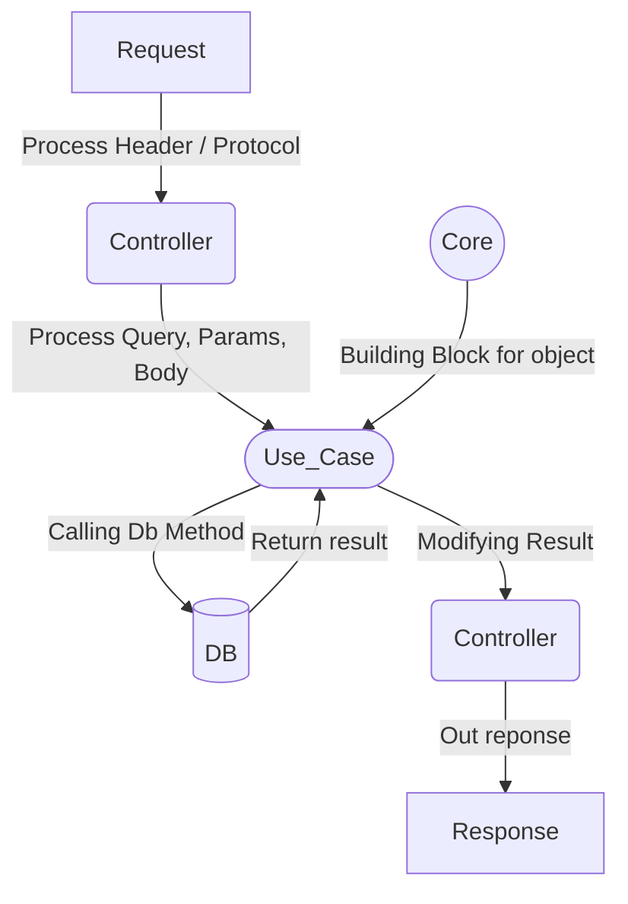

# Nodejs API Clean Architecture

> "In the world where everyday rise a new javascript framework, one shall not depend solely on the modul that they import, but the program that they design".  ~ Sun Tzu, probably

Clean architecture is a way to pursue sustaniable program that could hold the test of everchanging library. One should not import library, but insted inject it. The limited flow of program due to its dependence of its library could be tiresome. A programer must mantain every breaking change or security issue in the module. We could insted, use a better way to approach it. It make look bothersome for the beginning, but it's rewarding once you understand it

## Flow Visualization

Check out [this video](https://youtu.be/CnailTcJV_U) for cleaner explanation